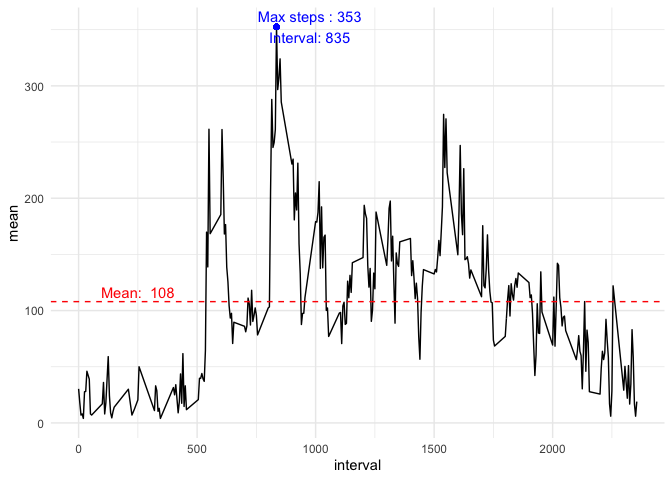
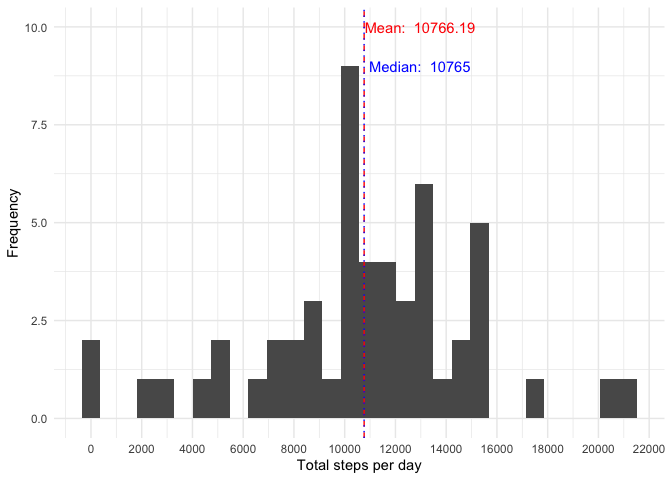
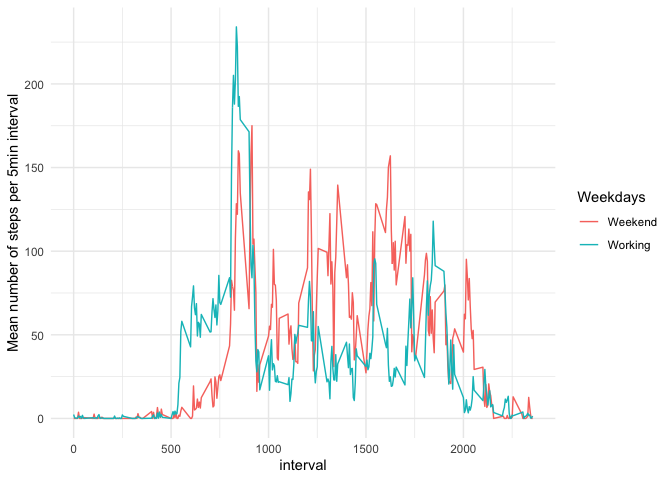

```r
#set global settings for code chunks
knitr::opts_chunk$set(warning=FALSE, message=FALSE, echo=TRUE)
```

## Loading and preprocessing the data
Load the data 
Process/transform the data (if necessary) into a format suitable for your analysis

```r
#unzip, load and convert to dates
unzip("activity.zip")
activity <- read.csv("activity.csv")
str(activity)
```

```
## 'data.frame':	17568 obs. of  3 variables:
##  $ steps   : int  NA NA NA NA NA NA NA NA NA NA ...
##  $ date    : chr  "2012-10-01" "2012-10-01" "2012-10-01" "2012-10-01" ...
##  $ interval: int  0 5 10 15 20 25 30 35 40 45 ...
```

```r
library(lubridate)
activity$date <- ymd(activity$date)
```


## What is mean total number of steps taken per day? 

1. Calculate the total number of steps taken per day
2. If you do not understand the difference between a histogram and a barplot, research the difference between them. Make a histogram of the total number of steps taken each day
3. Calculate and report the mean and median of the total number of steps taken per day

```r
library(tidyverse)
#summary statistics groped by date
sum.activity <- activity %>%
  na.omit()%>%
  group_by(date)%>%
  filter(steps!=0) %>%
  summarize(total = sum(steps))

#calculate mean and median
mean.act <- mean(sum.activity$total, na.rm=TRUE)
median.act <- median(sum.activity$total,na.rm = TRUE)

#plot
ggplot(sum.activity)+
  geom_histogram(aes(x=total), bins=30)+
  ylab(label="Frequency")+
  xlab(label="Total steps per day")+
  geom_vline(aes(xintercept = mean.act),
             linetype=2,color="red")+
  annotate("text",x=mean.act+2200,y=10,color="red",
           label=paste("Mean: ",format(mean.act)))+
  geom_vline(aes(xintercept = median.act),
             linetype=3,color="blue")+
  annotate("text",x=median.act+2200,y=9,color="blue",
           label=paste("Median: ",format(median.act)))+
  scale_x_continuous(breaks = seq(0,35000,by=2000))+
  theme_minimal()
```

<!-- -->


## What is the average daily activity pattern? 

1. Make a time series plotof the 5-minute interval (x-axis) and the average number of steps taken, averaged across all days (y-axis)
2. Which 5-minute interval, on average across all the days in the dataset, contains the maximum number of steps?

```r
#aggregate average steps per interval
sum.steps <- activity %>%
  na.omit()%>%
  group_by(interval)%>%
  filter(steps!=0) %>%
  summarize(total = sum(steps),mean= mean(steps,na.rm = TRUE))

#calculate mean and median and coordinates to plot it
mean.steps <- mean(sum.steps$mean, na.rm = TRUE)
x.max <- as.numeric(sum.steps[which.max(sum.steps$mean),][1])
y.max <- as.numeric(sum.steps[which.max(sum.steps$mean),][3])

#plot
ggplot(sum.steps)+
  geom_line(aes(x=interval,y=mean) ,size=.5)+
  geom_hline(aes(yintercept=mean.steps),
             linetype=2,color="red")+
  annotate("text",x=250,y=mean.steps+8, color="red",
           label= paste("Mean: ",ceiling(mean.steps)))+
  annotate("text", x=x.max+140,y=y.max, color = 'blue',
           label = paste0("Max steps : ",ceiling(y.max),"\nInterval: ",ceiling(x.max)))+
  geom_point(aes(x=x.max,y=y.max),color="blue")+
  theme_minimal()
```

<!-- -->

## Imputing missing values

1. Calculate and report the total number of missing values in the dataset (i.e. the total number of rows with \color{red}{\verb|NA|}NAs)

```r
#summary how many NAs
colSums(is.na(activity))
```

```
##    steps     date interval 
##     2304        0        0
```
**We have 2304 NAs**

2. Devise a strategy for filling in all of the missing values in the dataset. The strategy does not need to be sophisticated. For example, you could use the mean/median for that day, or the mean for that 5-minute interval, etc.
3. Create a new dataset that is equal to the original dataset but with the missing data filled in.

```r
#replace NAs with mean by interval
fill.activity <- activity %>%
  group_by(interval) %>%
  mutate(impute.steps = replace(steps, is.na(steps), mean(steps,na.rm = TRUE)))

#check that in fill.activity column there is no NAs
colSums(is.na(fill.activity))
```

```
##        steps         date     interval impute.steps 
##         2304            0            0            0
```
**Impute.steps has zero NAs** those will be used further for plots.


4. Make a histogram of the total number of steps taken each day and Calculate and report the mean and median total number of steps taken per day. Do these values differ from the estimates from the first part of the assignment? What is the impact of imputing missing data on the estimates of the total daily number of steps?

```r
#aggregate summary of steps after imputation
sum.impute.activity <- fill.activity %>%
  na.omit()%>%
  group_by(date)%>%
  filter(steps!=0) %>%
  summarize(total = sum(impute.steps))
#calculate mean and median
mean.act.impute <- mean(sum.impute.activity$total, na.rm=TRUE)
median.act.impute <- median(sum.impute.activity$total,na.rm = TRUE)

#plot
ggplot(sum.impute.activity)+
  geom_histogram(aes(x=total), bins=30)+
  ylab(label="Frequency")+
  xlab(label="Total steps per day")+
  geom_vline(aes(xintercept = mean.act.impute),
             linetype=2,color="red")+
  annotate("text",x=mean.act.impute+2200,y=10,color="red",
           label=paste("Mean: ",format(mean.act.impute)))+
  geom_vline(aes(xintercept = median.act.impute),
             linetype=3,color="blue")+
  annotate("text",x=median.act.impute+2200,y=9,color="blue",
           label=paste("Median: ",format(median.act)))+
  scale_x_continuous(breaks = seq(0,35000,by=2000))+
  theme_minimal()
```

<!-- -->


```r
#show the mean and median before/after imputation
tibble(
  STAT = c("Mean","Median"),
  RAW = c(mean.act, median.act),
  IMPUTED = c(mean.act.impute,median.act.impute)
)
```

```
## # A tibble: 2 x 3
##   STAT      RAW IMPUTED
##   <chr>   <dbl>   <dbl>
## 1 Mean   10766.  10766.
## 2 Median 10765   10765
```

## Are there differences in activity patterns between weekdays and weekends? 

1. Create a new factor variable in the dataset with two levels – “weekday” and “weekend” indicating whether a given date is a weekday or weekend day.
2. Make a panel plot containing a time series plot (i.e. \color{red}{\verb|type = "l"|}type = "l") of the 5-minute interval (x-axis) and the average number of steps taken, averaged across all weekday days or weekend days (y-axis). See the README file in the GitHub repository to see an example of what this plot should look like using simulated data. 

```r
#create factor variable
week.fill.activity <- fill.activity %>%
  mutate("Weekdays"=if_else(weekdays(date) %in% c("Sunday","Saturday"),"Weekend","Working"))

#aggregate summary
sum.week.fill.activity <- week.fill.activity %>%
  group_by(interval, Weekdays)%>%
  summarise(mean=mean(steps,na.rm=TRUE))
  

#plot time series
ggplot(sum.week.fill.activity)+
  geom_line(aes(x=interval,y=mean, color=Weekdays) ,size=.5)+
  ylab(label = "Mean number of steps per 5min interval")+
  theme_minimal()
```

<!-- -->
